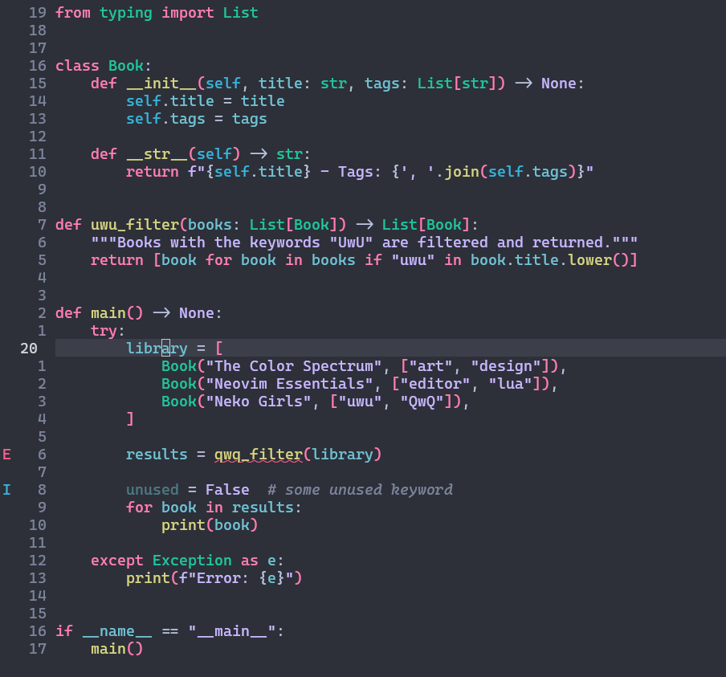

# lytmode.nvim

Inspired by [LYT-Mode](https://github.com/nickmilo/LYT-Mode) colorscheme for Obsidian.

Just like the original LYT Mode, this theme **does not** separate colors into light and dark modes.
It's not dark, and it's not light — it's something in between.




## Supported Languages and Plugins

This theme is based on [Mofiqul/vscode.nvim](https://github.com/Mofiqul/vscode.nvim), so **all languages and most common plugins should be supported**.

Primarily tested with **Python** 🐍, but many other languages work well too.

### ✅ Tested Plugins

- [Telescope](https://github.com/nvim-telescope/telescope.nvim)  
- [Treesitter](https://github.com/nvim-treesitter/nvim-treesitter)  
- [LSP Config](https://github.com/neovim/nvim-lspconfig)  
- [nvim-cmp](https://github.com/hrsh7th/nvim-cmp)  
- [rainbow-delimiters](https://gitlab.com/HiPhish/rainbow-delimiters.nvim)

### 🧪 Untested but likely compatible

- [BarBar](https://github.com/romgrk/barbar.nvim)
- [BufferLine](https://github.com/akinsho/nvim-bufferline.lua)
- [Dashboard](https://github.com/glepnir/dashboard-nvim)
- [Git Gutter](https://github.com/airblade/vim-gitgutter)
- [Git Signs](https://github.com/lewis6991/gitsigns.nvim)
- [Indent Blankline](https://github.com/lukas-reineke/indent-blankline.nvim)
- [Lualine](https://github.com/hoob3rt/lualine.nvim)
- [Neotest](https://github.com/nvim-neotest/neotest)
- [Neogit](https://github.com/NeogitOrg/neogit)
- [NvimTree](https://github.com/kyazdani42/nvim-tree.lua)
- [Trouble](https://github.com/folke/trouble.nvim)
- [nvim-compe](https://github.com/hrsh7th/nvim-compe)
- [nvim-dap-ui](https://github.com/rcarriga/nvim-dap-ui)
- [vim-illuminate](https://github.com/RRethy/vim-illuminate)

## 📦 Installation

Using [Lazy.nvim](https://github.com/folke/lazy.nvim):

```lua
return {
    "github-main-user/lytmode.nvim",
    lazy = false,
    priority = 1000,
    config = function()
        require('lytmode').setup()
    end
}
```

Additional configuration:

```lua
local c = require('lytmode.colors').get_colors()
require('lytmode').setup({
    -- Enable transparent background
    transparent = true,

    -- Enable italic comment
    italic_comments = true,

    -- Enable italic inlay type hints
    italic_inlayhints = true,

    -- Underline `@markup.link.*` variants
    underline_links = true,

    -- Disable nvim-tree background color
    disable_nvimtree_bg = true,

    -- Apply theme colors to terminal
    terminal_colors = true,

    -- Override colors (see ./lua/lytmode/colors.lua)
    color_overrides = {
        lytLineNumber = '#FFFFFF',
    },

    -- Override highlight groups (see ./lua/lytmode/theme.lua)
    group_overrides = {
        -- this supports the same val table as vim.api.nvim_set_hl
        -- use colors from this colorscheme by requiring lytmode.colors!
        Cursor = { fg=c.lytDarkBlue, bg=c.lytLightGreen, bold=true },
    }
})
```

---
Contributions, issues, or ideas are totally welcome!
